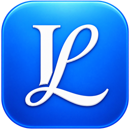

<div align="center">



# LitBoard

**Local-first reference manager & reading dashboard for Windows**

Collect, read, annotate, note, search and cite — everything lives in one SQLite file on your own disk.

**English** · [简体中文](README.zh-CN.md)

[](LICENSE)
[](#requirements)
[](#build-from-source)
[-green.svg)](#interface-languages)
[](#privacy--network-access)

</div>

LitBoard is a **local-first personal reference manager for Windows**. Your library is a single SQLite
database on your own disk — no account, no server, no telemetry — while still covering the whole research
loop: collect papers, read and annotate PDF/EPUB/scans, take notes that stay bound to the highlight they
came from, find anything with substring full-text search, and cite from the same library in
Word, LaTeX or Typst. Cloud sync is optional and uses your own Nutstore (Jianguoyun) WebDAV account.

> **Interface language:** Simplified Chinese / English, switchable in *Settings → Preferences* and applied
> immediately. Project documentation is Chinese-first; this page is the English entry point.

## Highlights

- **Local-first by default.** Papers, notes, annotations and indexes live in `%APPDATA%\LitBoard\litboard.sqlite`.
  Nothing is uploaded to a LitBoard server, because there is no LitBoard server.
- **Reads what you actually have.** PDF (text-based *and* scanned), EPUB and Zotero web snapshots, in one
  multi-tab reader with a shared search box.
- **Annotations travel back into the PDF.** Highlights, underlines, sticky notes, area screenshots and
  freehand ink are written back as standard PDF annotations that other readers can see — and annotations
  already in the file are imported on open.
- **Notes bound to their source.** Every excerpt block keeps a reference to the annotation it came from, so
  when the source changes you get a *stale* badge offering adopt-update / keep / remove instead of a silently
  wrong quote.
- **Search that finds substrings.** An FTS5 trigram index over extracted PDF text searches Chinese and
  English by substring with no word segmentation, plus an advanced query language and smart folders.
- **Cite without leaving the library.** 11 built-in CSL styles (GB/T 7714, APA 7, MLA 9, Nature, IEEE,
  Vancouver, Elsevier, Chicago…), any style from the official CSL repository, automatic `.bib` export on
  save, and a zero-install Word integration that needs no macros.
- **Sync and backup you own.** Nutstore WebDAV for multi-device sync with per-field conflict comparison,
  and content-addressed daily snapshots to a directory of your choosing.
- **An optional AI research assistant** that works in a *separate* research library, so experiments never
  touch your real one.

## Features

### Collect

- Import `.bib` / `.bibtex` / `.txt` / `.ris` / `.json` (LitBoard backup or CSL-JSON) and `.pdf`; drag files
  straight into the window. EndNote users should export RIS first.
- **Browser extension (Chrome/Edge, MV3)** — one click on a publisher page, arXiv, PubMed, Google Scholar,
  bioRxiv/medRxiv, PLOS, **CNKI (知网)** and 15+ other sites saves the record and pulls the open-access PDF.
  The save location follows the folder you are currently viewing, like Zotero. DOIs missing from the page are
  completed through OpenAlex → Crossref.
- **Quick add** by DOI, arXiv ID, PMID, ISBN or title — metadata is fetched and filed in one step.
- Reads the first two pages of a PDF to recover DOI/title and records the local file path.
- **One-click PDF download** of open-access full text found via OpenAlex / Semantic Scholar, with an optional
  EZproxy prefix for subscription content.
- **Zotero import** — read-only import of a local `zotero.sqlite` (with snapshot fallback) plus Zotero cloud
  attachment migration; folders merge by id and keep your local renames, existing records are never
  overwritten.
- Metadata enrichment from OpenAlex, Semantic Scholar, Crossref, PubMed and OpenLibrary, in bulk or one at a
  time; deduplication by DOI, normalised title, or PDF content fingerprint.
- 12 item types, with manual creation and editing of any field (volume, issue, pages, publisher, ISSN/ISBN,
  language, citekey…).

### Read

- **Built-in PDF reader** — multi-tab, outline and thumbnail sidebar, remembered reading position, two-page
  layout, rotation, in-document word-level search.
- **EPUB reader** on the same tab bar: chapter navigation, font size and theme controls, a progress bar you
  can click to jump, and reading position stored per attachment (CFI).
- **Reflow mode** for PDFs: rebuilds a page as a clean text flow for narrow windows and small screens.
- **OCR for scans** — page or whole-document recognition (Chinese + English) via tesseract, with results fed
  straight into the full-text index.
- Zoom, layout and rotation **re-render in place**: old bitmaps are stretched as a preview until the new page
  lands, so there is no white flicker.
- Text selection is geometry-driven, so the highlight you see, the text you copy and the annotation
  coordinates all agree.

### Annotate & excerpt

- Highlight, underline, sticky note, area screenshot and freehand ink.
- **Write annotations back into the PDF** as standard annotations, and **import annotations that already
  exist in the file**.
- Send a single annotation, a filtered set (by colour or tag), or every annotation in the document into a note
  as an *excerpt block*.
- Excerpt blocks are a stable contract (`<!--lbex {json} -->`) carrying paper id, attachment id, annotation
  id, page, the source timestamp and a citation snapshot — so they survive markdown ↔ rich text ↔ Word
  round-trips without losing their provenance.
- Deep links everywhere: `litboard://open/paper/<id>?attachment=&annotation=&page=` opens the exact
  highlight from a note, the browser extension, or an external application.

### Notes

- **Rich-text notes** in a wide contenteditable editor (headings, lists, tables, images) with a whitelist
  sanitizer as the only way in or out.
- Images are stored in a managed `note-assets/` directory, so they are backed up and synced like any other
  attachment.
- Old Markdown notes migrate one-way when opened, keeping the original in `note.sourceMarkdown` so exports
  stay faithful.
- Notes are first-class entities: stable ids, topic notes (no paper), deletion tombstones, and the paper's
  first note mirrored as a compatibility projection only.
- Export a note to Word (`.docx`) with citations and a bibliography rendered through the same CSL pipeline
  the Word integration uses.
- Markdown preview renders note images and internal `litboard://` links.

### Organize & search

- Folders with drag-and-drop (a multi-selection drags as one batch), `Parent/Child` tag hierarchy with
  colours, five-star rating, and unread / reading / read status.
- **Advanced query language**: `tag:review year>=2020 AND has:pdf`, quoted phrases, `/regex/`, parentheses,
  `folder:"name"` with subfolder drill-down, `missing:doi`, `has:epub|snapshot|supp|attachment`, and
  cross-level groups such as `ann(text:"quantum" color:#ffd400)` where all conditions must be met by the same
  annotation. Save any query as a **smart folder** (stored as a versioned AST, editable via the pencil
  button).
- **Ctrl+click multi-selects** folders and smart folders into a union, and switching views keeps your filters
  instead of clearing them.
- **Full-text search** over the whole library — FTS5 trigram index (`pdf_fts`), Chinese/English substring
  matching, hit pages you can jump to, and full-text search inside reflow mode too.
- A result view spanning four entity kinds — papers, annotations, notes, attachments — with a normalised
  substring filter and click-through to the source.
- Trash with restore and permanent deletion, retention configurable.
- Bulk operations on a multi-selection: change status, add tags, edit fields, enrich, rename, export, delete.
- **Session-level undo/redo** (`Ctrl+Z` / `Ctrl+Y`) storing snapshots of only the affected entities.
- Library-wide dedupe and merge, author-name merging, related-paper links, reading statistics and a
  publication-year distribution chart.
- Batch PDF renaming with a ZotFile-style template engine.
- Keyboard shortcuts (`?` lists them) and undo for deletions.

### Cite & write

- **Hand-written APA / GB-T / MLA** renderers for speed, plus a full **CSL engine** (citeproc-js) with
  **11 built-in styles**: GB/T 7714 numeric and author-date (customised for Chinese thesis conventions),
  APA 7th, MLA 9th, Nature, IEEE, Vancouver, Elsevier ×2 and Chicago ×2. Any other style can be fetched from
  the official CSL repository or imported from a local `.csl` file.
- Edit and pin the citekey; **the `.bib` is exported automatically on save** for Overleaf / Typst / LaTeX
  workflows. Export formats also include JSON, CSV and RIS for Zotero / EndNote interop.
- **Stateful citation documents** (`js/csldoc.js`): citation clusters serialise, relink and renumber as a
  unit, and each entry carries a CSL snapshot so it still renders when the paper is not in the library.
- **Word integration with zero install and no macros** — a resident JScript bridge drives Word through COM.
  Insert citations (multi-select dialog with search, insertion order = merge order, automatic
  document-order renumbering), switch the style per document, refresh, insert the bibliography, and unlink a
  copy. Tested end-to-end on Word 2016.
- Citation field codes are versioned and namespaced (` ADDIN LitBoard.Citation.1 "{json}"`) — deliberately
  *not* pretending to be a Zotero field. A converter rewrites existing `ZOTERO_ITEM CSL_CITATION` fields into
  LitBoard fields in a new copy of the document, preserving field results for unmatched items.
- Formatting fidelity comes from one shared HTML lexer: citation text and bibliography become RTF runs (for
  Word) or `docx` runs (for export), so superscripts, italics and hanging indents look identical in both.
- Bilingual citation rendering: an entry whose only CJK content is 「等」 renders as *et al.* automatically.

### Sync & backup

- **Nutstore (Jianguoyun) WebDAV** sync, protocol v5: entity-level last-write-wins with tombstones,
  plan-based three-way merge, ETag conditional writes, delete propagation, and conflict pausing with a field-
  and attachment-level comparison view inside the progress dialog.
- Choose **which side wins per entity**: "adopt this machine's version" keeps the remote value in the cloud
  and pins both snapshots in the sync base until either side changes again.
- Attachments and annotation snapshots are verified by SHA-256 and restored atomically. A local signature
  (cloud hash + size + mtime) skips re-hashing when nothing has changed, and an upload ledger resumes
  interrupted transfers without re-sending them.
- Every overwritten version is recorded in `sync-conflicts.jsonl`.
- **Daily full snapshots** to an independent directory: the database (indexes included, compressed) plus
  every managed attachment, de-duplicated into a content-addressed `objects/` store so one file is stored
  once across all snapshots. An identical state does not consume a rotation slot; retention is configurable
  (1–30, default 7).
- Restore verifies hashes first, and **a corrupt database is never deleted, overwritten or silently
  rebuilt** — the newest valid snapshot is preferred, and the original is kept as `*.corrupt-*`.
- Move your config/cache and library directories to another drive. This is a *move*: copy → per-file byte
  verification → switch the pointer file → clear the old directory, with failures retried on the next launch
  and anything preserved reported honestly in Settings.

### AI research assistant (optional)

- A **separate research library** (`research/` in the config directory, migrated with your data directory)
  whose identities are proxy keys that never change. Your real library is untouched unless you explicitly
  collect something into it.
- Chat over any endpoint you configure — OpenAI-compatible (DashScope/Qwen, OpenAI, DeepSeek, OpenRouter,
  local Ollama) or Anthropic-compatible (Claude, and the `/anthropic` endpoints of DeepSeek, Zhipu GLM and
  Z.ai) — with streaming, tool calls, collapsible reasoning, edit-and-resend, regenerate and per-turn retry.
  The protocol (Chat Completions / Responses / Messages) is detected from the Base URL and shown in Settings;
  OpenCode Zen/Go endpoints also get the `x-opencode-session` header they require. Failures never trigger
  an invisible automatic retry that costs you money.
- Tool set: library search, research-library search, OpenAlex discovery (keyword and semantic),
  Semantic Scholar, semantic search over the research library, work details, full-text hits — plus three write tools (collect into library, download PDFs, file PDFs) that always ask
  for confirmation before they touch anything.
- **Citation-network builder**: BFS expansion over OpenAlex `referenced_works` (depth 1–3, 10–500 nodes),
  degree and PageRank statistics, an interactive vis-network view, and export as a self-contained offline
  HTML snapshot.
- **Scientific web search (TinyFish)**, off by default and gated behind an explicit data-egress
  acknowledgement. Fetched pages are saved as local snapshot attachments and indexed for full-text search.
- Conversations are stored under `会话记录/<date>/<title>/` with `session.json` as the single source of
  truth and a generated Markdown transcript; deleting a session sends it to the recycle bin. Streaming text
  is flushed at defined checkpoints (turn start, before each tool call, tool result, turn end), so force-
  quitting loses only the half-finished turn — which reopens marked as interrupted with a manual retry.

### Interface languages

- Simplified Chinese and English, switchable instantly in *Settings → Preferences* (`auto` follows the
  system). Dictionary keys are the Chinese source strings, and a missing entry falls back to the original, so
  the UI never shows an empty hole. **Stored data is never translated** — interface language ≠ citation
  language ≠ your data.

### Themes

- Light, dark and follow-system, plus 10 curated themes: GitHub Light, Catppuccin Latte / Mocha, Solarized
  Light, One Light, Gruvbox Light, Dracula, Tokyo Night, Nord and One Dark.

## Privacy & network access

LitBoard has no server of its own, so your library and notes are never uploaded to us. These actions do use
the network:

- **Metadata enrichment** sends a DOI or title to OpenAlex, Semantic Scholar, Crossref, PubMed or
  OpenLibrary.
- **Download PDF** sends the DOI or title to OpenAlex / Semantic Scholar to locate open-access copies; the
  file is saved to the location you choose.
- **The browser extension** posts metadata to `127.0.0.1` on your own machine only; DOI completion goes to
  OpenAlex. CNKI pages are parsed from the CNKI export endpoint, and CNKI PDFs are downloaded by the browser
  with your session and handed to the desktop app locally.
- **OCR** downloads a tesseract language pack (~15 MB) from jsDelivr the first time; recognition itself is
  fully local.
- **Nutstore sync** writes library metadata, attachments and annotation snapshots into the WebDAV directory
  you configure. Your Nutstore account, app password, local paths and extension token never leave the
  machine. WebDAV addresses must use HTTPS (loopback is allowed for testing).
- **Semantic search** sends titles and abstracts to your chosen embedding provider (off by default).
- **Translation, journal-ranking lookups and the AI assistant** talk only to the providers you configure.

PDF.js, PDFium, citeproc, tesseract, epub.js and vis-network are all bundled locally. **Neither the desktop
app nor the browser-opened mode depends on any CDN** — `index.html`'s CSP allows only `'self'` and the
metadata API hosts. Network services can rate-limit; browsing, filtering, note-taking and exporting work
fully offline.

## Install & quick start

1. Download `LitBoard-Setup-<version>-x64.exe` from the releases page (or from a local build, see below);
   `LitBoard-Portable-<version>-x64.exe` runs without installing.
2. Click **Import files** to load `.bib` / `.ris` / `.json` / `.pdf`, or drag files into the window. **Add**
   accepts a DOI / arXiv ID / PMID / ISBN / title and fetches the metadata for you.
3. Double-click an entry to read: highlight, annotate, take area screenshots, and send excerpts to a note.
4. Open **Settings → Data & backup** and point the snapshot directory at an independent folder (OneDrive or
   an external drive is a good choice).

On first launch the app creates:

```text
%APPDATA%\LitBoard\litboard.sqlite         main database (papers / folders / annotations / indexes / settings)
%APPDATA%\LitBoard\litboard.sqlite.bak     legacy daily backup
```

Both the config/cache directory and the library directory can be relocated separately in
*Settings → Data & backup*. Upgrading from an old version migrates `library.v1.json` and `pdftext.v1.json`
into SQLite on first launch and renames the originals to `*.migrated` rather than deleting them.

> The installers are **not code-signed**, so SmartScreen shows "unknown publisher" — choose **Run anyway**.

## Optional API keys

Metadata enrichment uses OpenAlex, Semantic Scholar and Crossref and needs no key. These integrations are
optional and configured in *Settings*:

### Translation / embeddings

- Qwen / DashScope — create a key in Alibaba Cloud Model Studio:
  <https://help.aliyun.com/zh/model-studio/get-api-key>
- Alibaba Cloud Machine Translation — activate the service
  (<https://help.aliyun.com/zh/machine-translation/getting-started/activate-machine-translation-for-developers>)
  then create an AccessKey
  (<https://help.aliyun.com/zh/machine-translation/getting-started/prepare-accounts-for-developers>);
  the credential format is `AccessKey ID@AccessKey Secret`
- OpenAI — <https://platform.openai.com/api-keys>
- DeepSeek — <https://platform.deepseek.com/api_keys> (translation only, no embeddings)

Other translation providers take a single API key. Semantic search exists only as an AI-assistant tool
(`semantic_search`, `find_literature`, `search_openalex` with `mode=semantic`); its vector model is
configured under *Settings → Integrations → Embeddings (research library)* with its own provider, Base URL,
API key and model name.

### SciGreat journal ranking

- OneScholar settings page — <https://www.scigreat.com/s/app/?t=onescholar-info>
- OneScholar home — <https://www.scigreat.com/s/app/?t=onescholar>

The key is used to look up journal quartiles, impact factors and CAS/JCR rankings; the *Test API* button in
Settings runs a connectivity query against Nature.

## Browser extension

1. In LitBoard open *Settings → Browser extension*, make sure the service is enabled and copy the token.
2. In Chrome/Edge open `chrome://extensions`, turn on *Developer mode* → *Load unpacked* → select the
   `extension/` directory (in a packaged install it is `resources/app/extension/`).
3. Fill in the port (default `24117`) and token on the extension options page; once *Test connection* passes,
   one click saves the paper you are reading.

`npm run pack-extension` builds `dist/LitBoard-Extension.zip`.

## Requirements

- **The application runs on Windows x64 only** — the packaging scripts are PowerShell and the artifacts are
  an NSIS installer and a Portable EXE. Word integration additionally needs a local Word install (COM
  automation; tested on Word 2016+).
- **Node.js ≥ 22.13.0 is required for development**, because the storage layer uses `node:sqlite`, which needs
  `--experimental-sqlite` before 22.13. `.nvmrc` pins 24 and `package.json` `engines` declares the floor.
- The test suite is plain Node and also runs on macOS / Linux — CI covers Windows and Ubuntu × Node 22 / 24.

## Build from source

The project keeps **zero `node_modules` in the repository**. Electron and electron-builder are installed by a
script into:

```text
%LOCALAPPDATA%\LitBoardBuildTools
```

Run the tests (plain Node, nothing to install):

```powershell
npm.cmd test
```

Lint (also works with zero `node_modules` — eslint is installed into the external tools directory if missing):

```powershell
npm.cmd run lint
```

Start the dev build and package:

```powershell
npm.cmd start
npm.cmd run dist
```

Release and verification helpers (all use isolated directories and never touch a real user library):

```powershell
npm.cmd run smoke             # functional smoke test (isolated Electron launch)
npm.cmd run smoke:lifecycle   # write → real shutdown → relaunch → data consistency
npm.cmd run perf              # cold start / load / save timings (P50/P95)
npm.cmd run vendor-hashes     # regenerate vendor/SHA256SUMS after upgrading a vendored library
npm.cmd run release-checksums # checksums for the artifacts in dist/
```

`npm run dist` bumps the patch version in `package.json` on every run, so the artifacts are:

```text
LitBoard-Setup-1.2.14-x64.exe
LitBoard-Portable-1.2.14-x64.exe
```

Application icons are generated by `npm run gen-icons` (`scripts/gen-icons.ps1`) into `build/icon.ico`, `build/icon-*.png` and
`extension/icons/*` — re-run it after changing the icon (`icon/Logo.png` is the source). The first `start` / `dist` / `lint` invocation needs
network access to download tools; to use a mirror set `$env:ELECTRON_MIRROR`.

## Project layout

```text
index.html              page structure
css/style.css           light/dark themes
js/model.js             validation and versioned data model (schema v13)
js/cite.js              APA / GB-T 7714 / MLA rendering and RIS output
js/cslcite.js           CSL engine wrapper (paper → CSL-JSON → citeproc)
js/csldoc.js            stateful citation document (clusters, snapshots, relink)
js/docx.js              minimal docx reader/writer (stored ZIP + CRC32, zero deps)
js/query.js             advanced query language (fields / boolean / comparison / regex)
js/sync.js              sync merge v5 (plan-based three-way merge, ETags, conflict report)
js/pdfimport.js         PDF text layer, reader rendering, in-page search
js/pdfannot.js          annotation write-back / import (pdf-lib)
js/epub.js              EPUB reader wrapper (epub.js + JSZip)
js/reflow.js            PDF reflow analysis (line clustering, column detection)
js/noteml.js            rich-text note contract (sanitizer, excerpt and citation nodes)
js/excerpt.js           excerpt block contract (build/parse/stale/replace)
js/agentcore.js         AI assistant state machine
js/agentproto.js        endpoint protocols: chat/responses/messages adaptation
js/graphgen.js          citation graph construction and offline HTML export
js/i18n.js, i18n-en.js  bilingual UI core and English dictionary
js/app.js               page state, rendering, interaction
electron/main.js        Electron main process (IPC / migration / backup / auto-export)
electron/db.js          SQLite storage layer (node:sqlite, FTS5 trigram, incremental save)
electron/integrations.js  Nutstore sync, translation, journal ranking, embeddings, Zotero import
electron/research-*.js  research library, OpenAlex client, embedding builder
electron/word-bridge.js Word COM bridge (driver for word/wordbridge.js)
electron/backup.js      snapshot creation, verification and restore
vendor/                 bundled third-party libraries (pdfjs, pdfium, pdflib, citeproc, tesseract, epub, vis-network…)
extension/              Chrome/Edge browser extension (MV3)
word/wordbridge.js      resident JScript Word COM bridge
scripts/                external-tool launchers and build scripts
test/                   node:test suite (data model, storage, sync, citations, i18n…)
docs/                   roadmap, third-party ledger, audit baseline, release checklist
```

The browser-opened mode still works by opening `index.html` directly, but the desktop build has more reliable
file, clipboard, network and storage access.

## License

LitBoard's own code is released under **AGPL-3.0-only** — see [LICENSE](LICENSE). Third-party components under
`vendor/` keep their own licenses and are not relicensed by this project:

- PDF.js (Apache-2.0), PDFium (BSD), pdf-lib (MIT), tesseract.js (Apache-2.0), bibtex-parse (MIT),
  assistant-ui chat bundle (MIT, built with an external esbuild from `scripts/agent-ui-bundle/`),
  vis-network (Apache-2.0 / MIT dual-licensed, used here under MIT)
- epub.js (BSD-2-Clause, © FuturePress), JSZip (MIT or GPLv3 dual-licensed, used here under MIT)
- citeproc-js (CPAL-1.0 / AGPL-3.0 dual-licensed, used here under CPAL, © Frank Bennett)
- CSL styles and locales (CC BY-SA 3.0, citation-style-language project)

## Documentation

- [README.zh-CN.md](README.zh-CN.md) — 中文说明（Chinese README）
- [CONTRIBUTING.md](CONTRIBUTING.md) — contribution workflow, code conventions and hard constraints
- [AGENTS.md](AGENTS.md) — architecture notes and red lines
- [CHANGELOG.md](CHANGELOG.md) — change history
- [docs/roadmap.md](docs/roadmap.md) — roadmap (M0–M8)
- [docs/THIRD-PARTY.md](docs/THIRD-PARTY.md) — third-party component ledger (version / source / hash / license)
- [docs/audit-baseline.md](docs/audit-baseline.md) — audit baseline and performance figures
- [docs/task-ledger.md](docs/task-ledger.md) — milestone task ledger (status per milestone)
- [docs/audits/](docs/audits/) — dated audit and review reports
- [docs/releasing.md](docs/releasing.md) — maintainer release checklist
- [SECURITY.md](SECURITY.md) — security policy
