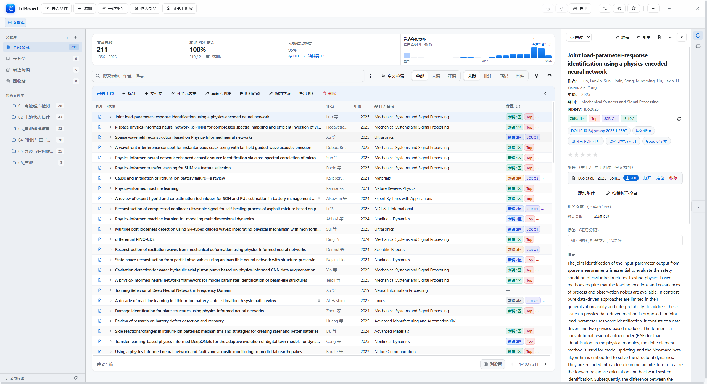
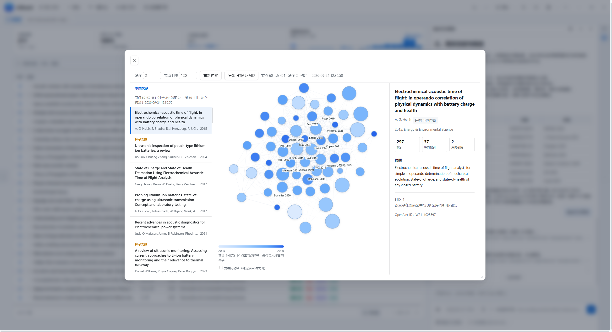
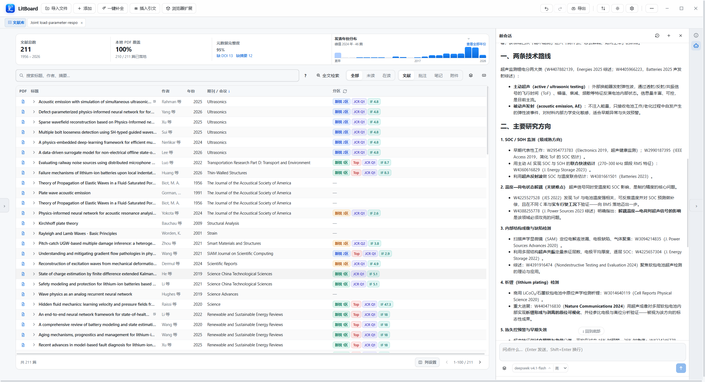
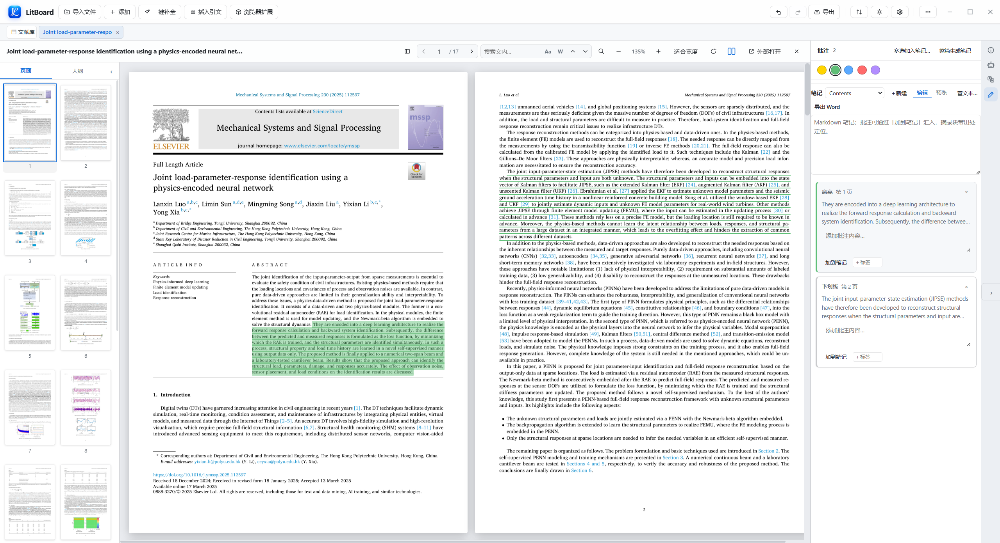
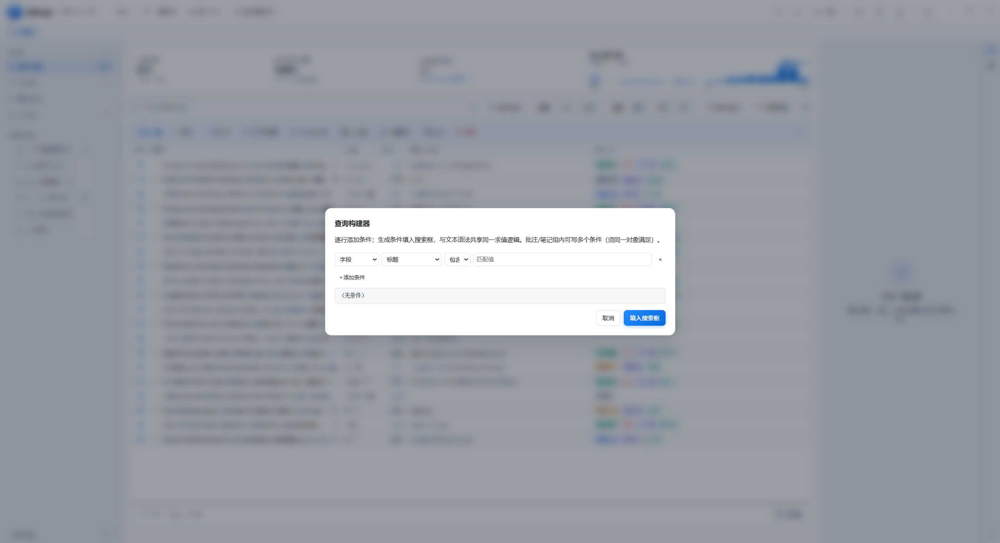
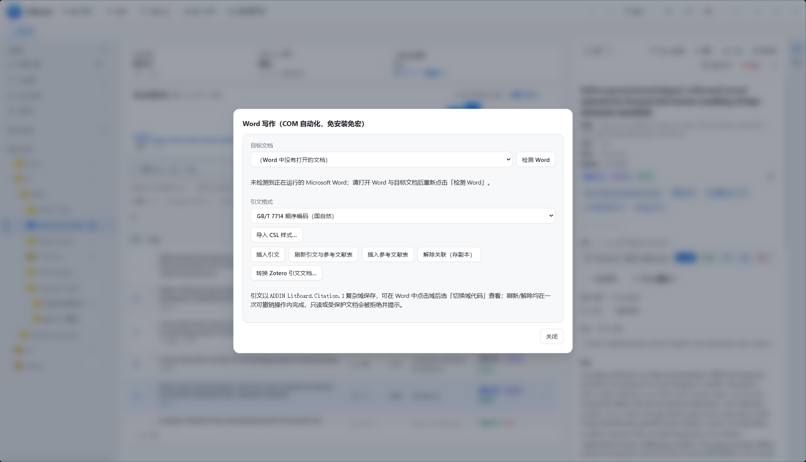

<div align="center">


# LitBoard

**以 AI 助手为核心的本地文献管理与调研工作台**

[English](README.md) · **简体中文** · [功能导览](docs/feature-tour.md) · [下载 Windows 版](https://github.com/L1nze/LitBoard/releases)

[](LICENSE)
[](#开始使用)

</div>

LitBoard 将 AI 助手融入文献管理与阅读：打开论文即可提问、查阅依据、检索相关研究，并通过引文网络梳理文献脉络。文件夹导入、浏览器采集、PDF / EPUB 阅读、批注与检索等常用能力集中在一个 Windows 应用中，减少对多个插件和工具的依赖。文献库默认保存在本机，可按需配置坚果云 WebDAV 同步与 AI 服务；导入、阅读和调研流程也针对大文献库做了响应优化。

## 界面预览

以下界面截图基于浅色主题展示。AI 对话与引文网络取自测试会话，其余界面使用演示数据。点击图片可查看原图。

<table>
  <tr>
    <td width="33.3%" align="center"><a href="docs/assets/screenshots/library.png"></a><br><strong>文献库与详情</strong></td>
    <td width="33.3%" align="center"><a href="docs/assets/screenshots/citation-graph.png"></a><br><strong>引文网络分析</strong></td>
    <td width="33.3%" align="center"><a href="docs/assets/screenshots/agent.png"></a><br><strong>AI 助手</strong></td>
  </tr>
  <tr>
    <td width="33.3%" align="center"><a href="docs/assets/screenshots/reader.png"></a><br><strong>内置阅读器</strong></td>
    <td width="33.3%" align="center"><a href="docs/assets/screenshots/search.png"></a><br><strong>组合检索</strong></td>
    <td width="33.3%" align="center"><a href="docs/assets/screenshots/citation.png"></a><br><strong>插入引文</strong></td>
  </tr>
</table>

## 核心特色

- **以 AI 助手为中心的文献调研**：在阅读器旁直接提问，让助手检索文献、查阅正文、核对论点，并把引用关系展开为可交互的网络。工具调用和依据可回看，结论仍由用户核实。
- **把常用功能集成到应用中**：文件夹导入与去重、PDF / EPUB 阅读、OCR、批注、笔记、全文检索和引用管理在同一工作台完成，减少为不同环节反复安装、配置插件的需要。
- **重视大文献库的操作响应**：针对增量保存、全文检索、批量导入和阅读器渲染优化处理流程，尽量减少文献量增长后出现的等待与卡顿。
- **本地优先的数据管理**：主文献库默认保存在本机，可创建快照；需要多设备使用时，再配置坚果云 WebDAV 同步。AI 调研数据与主库分开保存。

## AI 助手：从阅读问题到文献脉络

打开论文后，可在阅读器旁向助手询问方法、图表或相关工作。助手能够按页或章节读取已建立索引的 PDF、EPUB 正文；遇到公式、图表或扫描页时，支持图像输入的模型还可查看渲染后的页面。回答会标明实际读取的范围，方便返回原文核对。

提出研究问题或粘贴一段论述时，助手可检索主文献库、独立调研库及 OpenAlex、Semantic Scholar 等外部来源；配置 Elsevier API Key 后也可检索 Scopus。对于论述核对，它会拆分论点、列出候选文献和摘要中的相关语句，区分有依据、部分相关与未找到依据的结果。引用关系可进一步生成交互式网络，用来查看相邻研究。

对话和工具记录可保存、继续或重试。模型服务端点、向量模型和凭据由用户配置；模型请求及在线检索会访问相应外部服务。助手找到的文献或 PDF 在写入主文献库前须经用户确认并检查重复项。没有配置 AI 服务时，仍可手动检索文献。

Agent文献调研工具的相关详情可参见我导师的开源项目 [PAPER-SQL](https://github.com/galois-yan/PAPER-SQL)。（相关能力在 LitBoard 内实现）

## 集成的文献管理与阅读功能

- **从已有资料继续**：Zotero 导入向导可读取本机文献、文件夹、附件、笔记和批注；重复导入按来源匹配并补齐缺失信息，不覆盖本地修改，也不更改原 Zotero 资料库。
- **集中收集资料**：可导入 PDF、BibTeX、RIS、CSL-JSON 和本地文件夹；Chrome / Edge 扩展可从受支持的学术页面保存文献记录。导入时检查重复条目，并管理文献与附件的关联。
- **在同一处阅读和查找**：在标签页中阅读 PDF、EPUB 与网页快照，使用目录、文内查找、扫描页 OCR 和批注；笔记可保留原文定位。检索覆盖元数据、笔记、批注及已建立索引的正文，支持组合条件。
- **按需使用引用功能**：可在 Word 中插入和更新 CSL 引文、参考文献表，或导出 BibTeX；这些功能不影响单独使用文献库和阅读器。

## 面向大文献库的响应优化

- **批量导入不逐篇重扫文献库**：导入前只建立一次指纹与 DOI 去重索引，随后用三路并发解析 PDF；导入整棵文件夹时，结果合并后统一保存。
- **长 PDF 只渲染正在阅读的区域**：阅读器优先绘制当前视口和邻近页面。连续缩放时先即时预览现有画面，停下后再重绘清晰页面，避免每滚动一档就重排整份文档。
- **AI 检索避免重复建索引**：外部检索再次返回同一文献时，标题、摘要等内容未变化就不重建调研库的全文索引；结果列表按页读取，不为每页额外统计全部命中项。
- **引文网络计算不占住主窗口**：在官方 Windows x64 构建中，图谱的社区、排序和布局计算交给异步的 Rust 内核执行，窗口仍可处理交互。

## 开始使用

LitBoard 提供 Windows x64 安装版与便携版，下载入口在 [GitHub Releases](https://github.com/L1nze/LitBoard/releases)；文件说明与校验方法见[下载说明](docs/release.md)。已打包的应用无需另行安装 Node.js。

1. **建立文献库**：使用「导入文件」添加 PDF、BibTeX、RIS 或 CSL-JSON；也可拖入本地文件夹，或通过「更多 → 导入文件夹」批量导入。已有 Zotero 资料库的用户，可从「设置 → 集成与服务 → Zotero 本机资料库」启动导入向导。
2. **启用 AI 助手**：在设置中填写模型服务端点、模型及凭据。需要向量检索时，再配置相应的向量模型；手动文献检索无需配置 AI 服务。
3. **保护与同步数据**：在「设置 → 数据与备份」选择快照位置。需要跨设备同步时，再配置个人坚果云 WebDAV 账号。

文件夹导入支持 PDF、EPUB、DjVu、MOBI、AZW3、DOC、DOCX、ODT 和 RTF。拖到文件夹树中的目标文件夹会归入该处，拖到其他区域则归入当前选中的文件夹；导入期间可停止，已处理的条目会保留。操作演示见[功能导览](docs/feature-tour.md)。

### 浏览器扩展

如需从学术网页采集文献，可在 Chrome / Edge 的扩展管理页启用开发者模式，加载已解压的扩展目录：安装版使用应用目录下的 `resources/extension/`，源码环境使用项目根目录的 `extension/`。随后在 LitBoard 顶栏「扩展」中开启本地接收服务，并把显示的端口与令牌填入扩展选项。

## 数据、同步与更新

主文献库、笔记和受管附件默认保存在 `%APPDATA%\LitBoard`，也可选择其他数据目录。快照可在「数据与备份」中创建和恢复；坚果云 WebDAV 同步为可选功能。

应用会检查 GitHub Releases 是否有更新的正式版本并提示下载，也可在设置中手动检查。下载后仍需自行完成升级；升级前建议创建快照。当前构建未进行代码签名，Windows SmartScreen 可能显示未知发布者提示，请通过发布的 SHA-256 校验值核对下载文件。

## 从源码运行

开发环境需要 Node.js 22.13.0 或更高版本。Electron 和构建工具由脚本安装到仓库外的 `%LOCALAPPDATA%\LitBoardBuildTools`；项目目录保持无 `node_modules`。

```powershell
npm.cmd test
npm.cmd run lint
npm.cmd start
npm.cmd run dist:nobump
```

`npm run dist` 会在打包前自动递增补丁版本号；按当前版本构建请使用 `npm run dist:nobump`。

## 许可证与第三方组件

LitBoard 自有代码采用 [MIT](LICENSE) 许可证。安装包还包含采用 AGPL-3.0-or-later 的 MuPDF.js，以及适用其他许可证的第三方组件；根目录的 MIT 许可证不替代这些组件各自的条款。随包组件、许可文件和不随包分发的设计来源见[第三方组件清单](docs/THIRD-PARTY.md)。
