# LitBoard 功能导览

这份导览按五段操作演示，展示从收集文献、阅读与调研，到在 Word 中引用文献的流程。LitBoard 是本地优先的 Windows 桌面应用；浏览器采集、AI 助手和 Word 写作分别需要相应的连接、模型服务或本机 Word。

## 1. 将文件夹导入文献库

把本地文件夹拖到左侧文件夹树中的目标位置，即可按原有目录结构导入。演示中，文件夹出现在侧栏，文献条目随后进入对应目录；再次拖入其他文件夹时，侧栏和列表继续更新。导入时会检查已有条目，减少重复文献。

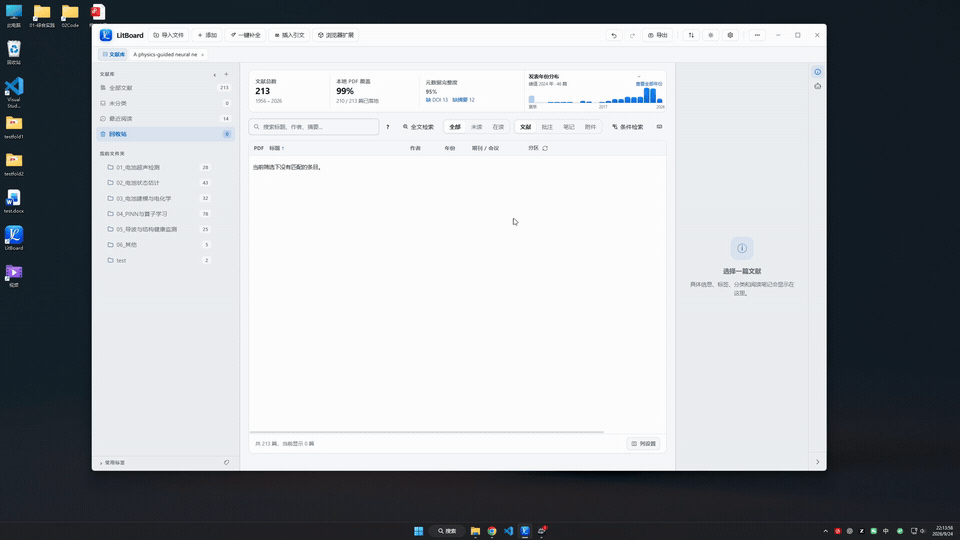

除拖放外，也可从菜单或文件夹右键入口启动导入。支持的文件类型和拖放位置说明见[项目说明](../README.zh-CN.md)。

## 2. 从浏览器采集文献

先在 LitBoard 顶栏的「扩展」中开启本地接收服务，再用令牌连接 Chrome / Edge 扩展。演示依次在中文学术页面和 ScienceDirect 页面打开扩展，将页面上的文献信息保存到桌面文献库，并在 LitBoard 中看到新条目。

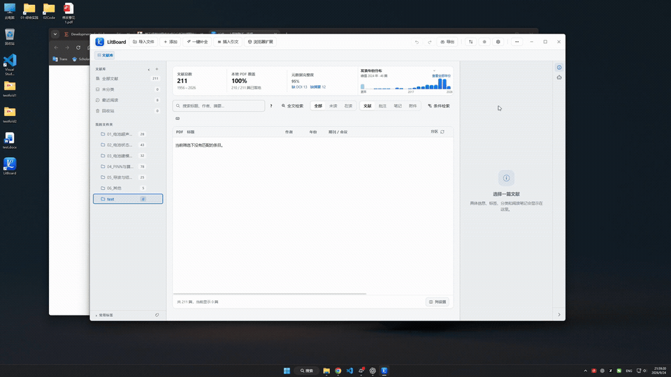

扩展从受支持页面提取信息；实际可取得的字段取决于站点页面，保存后可在文献详情中核对和补充。

## 3. 在 PDF 旁使用 AI 辅助阅读

打开 PDF 后，可以在右侧 AI 助手中围绕当前文献提问。演示中，助手调用阅读工具查看相关页面，再把找到的内容组织为回答。阅读工具实际取得的文字或页面范围，仍需结合原文核对。

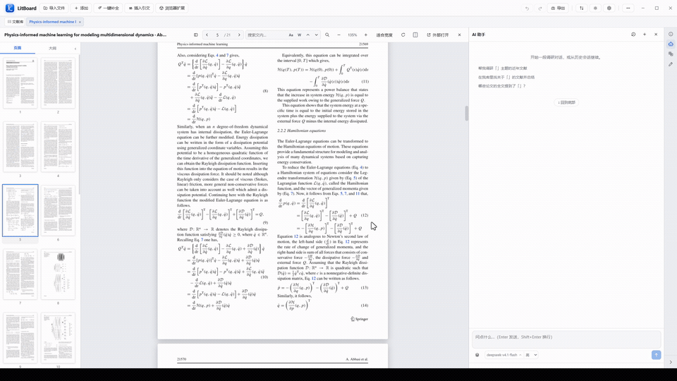

此功能需要配置可用的模型服务。PDF 阅读本身不依赖 AI；还可使用目录、文内查找和批注等阅读功能。

## 4. 在 Word 中插入引文

从 LitBoard 的 Word 写作面板选择引用样式和库内文献，将引文插入当前 Word 文档，并生成参考文献表。演示展示了选择文献、在正文中插入引文，以及查看文末参考文献的过程。

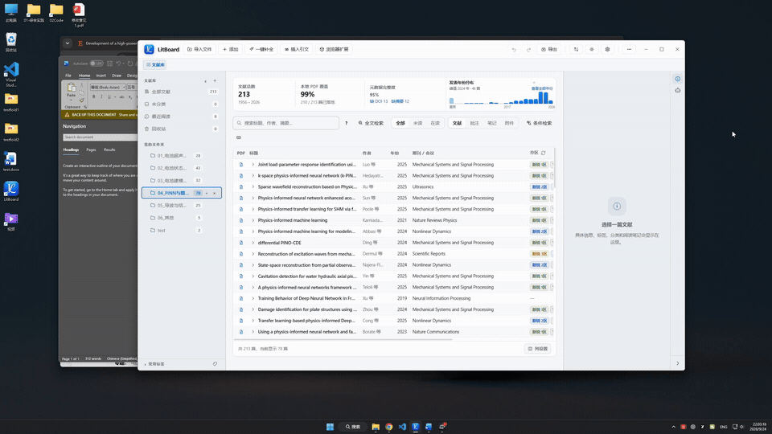

直接写入 Word 需要本机安装 Microsoft Word。引文和参考文献使用所选 CSL 样式；文献条目信息有误时，应先在库内修正，再更新文档中的引用。

## 5. 用 AI 助手检索与梳理研究问题

向 AI 助手提出研究问题后，演示依次展示工具检索、回答生成和引文网络。引文网络把已取得的文献引用关系呈现为可交互的图，便于继续查看相关研究。

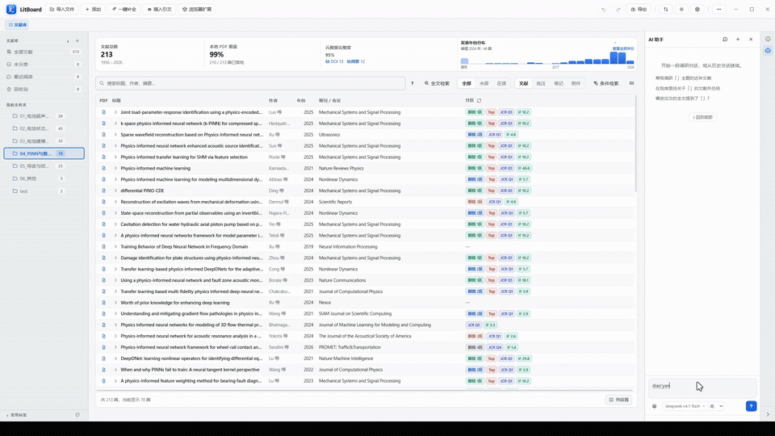

AI 对话需要配置模型服务；在线检索会访问外部文献服务。检索结果、回答和引文关系都应回到文献原文核查。助手的调研数据与主文献库分开保存，将找到的文献写入主库前会请求确认。

## 界面主题

每行对比同一编号的浅色与深色主题。点击缩略图可查看完整界面。

<table>
  <tr>
    <td width="50%" align="center"> 浅色 1</td>
    <td width="50%" align="center"><a href="assets/theme/dark1.png">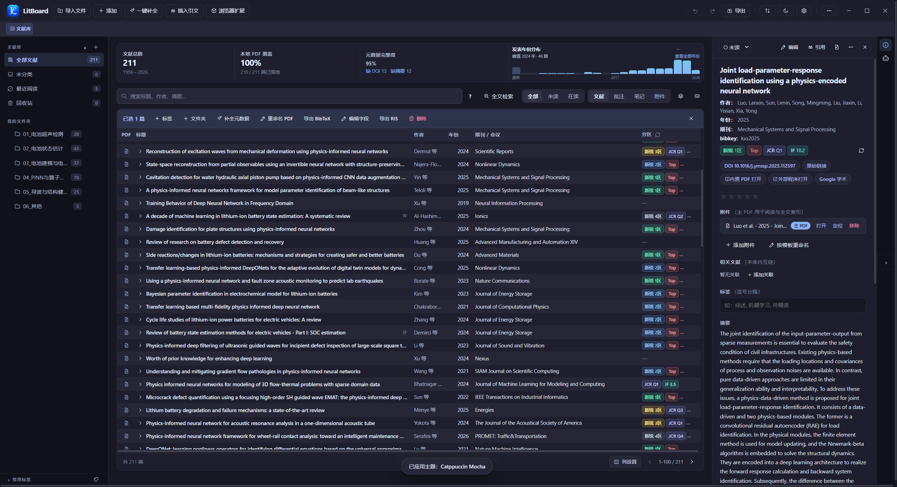</a> 深色 1</td>
  </tr>
  <tr>
    <td width="50%" align="center"><a href="assets/theme/light2.png">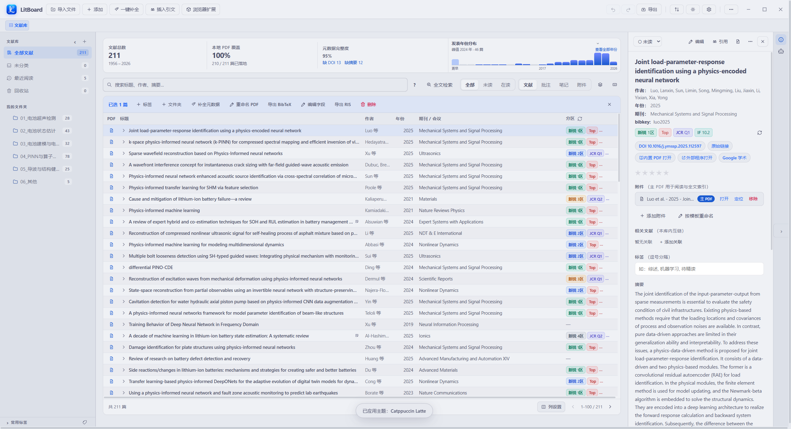</a> 浅色 2</td>
    <td width="50%" align="center"><a href="assets/theme/dark2.png">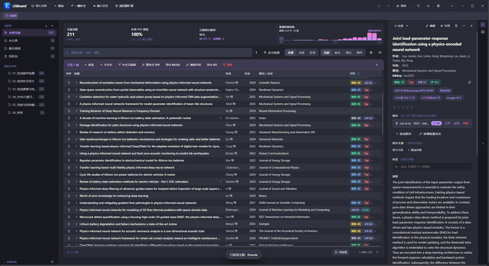</a> 深色 2</td>
  </tr>
  <tr>
    <td width="50%" align="center"><a href="assets/theme/light3.png">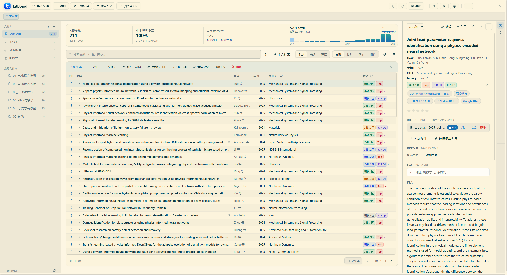</a> 浅色 3</td>
    <td width="50%" align="center"><a href="assets/theme/dark3.png">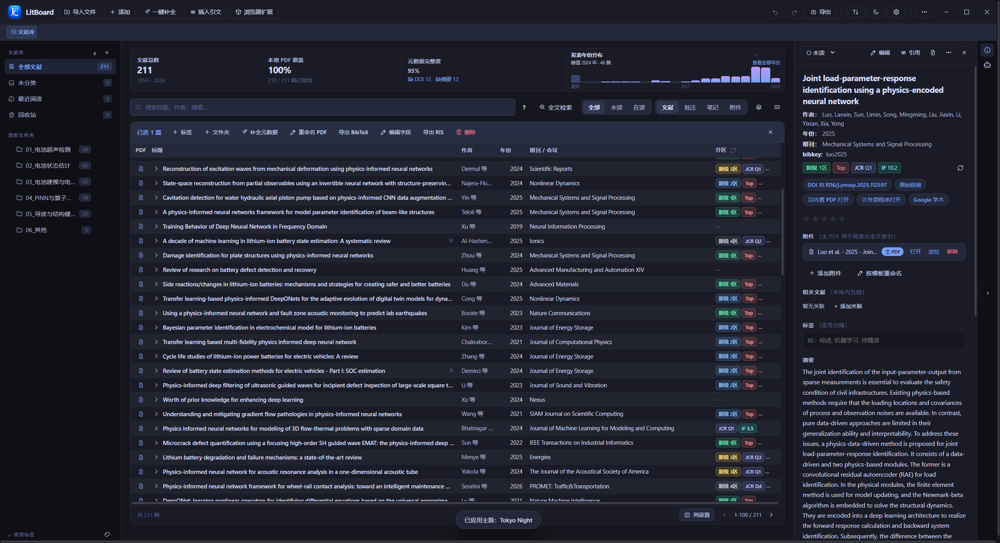</a> 深色 3</td>
  </tr>
  <tr>
    <td width="50%" align="center"><a href="assets/theme/light4.png">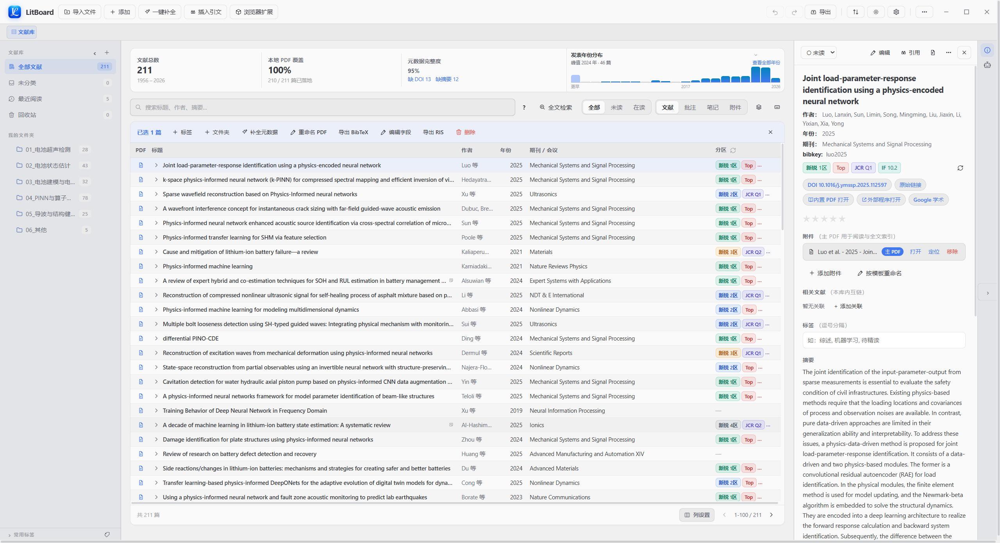</a> 浅色 4</td>
    <td width="50%" align="center"><a href="assets/theme/dark4.png">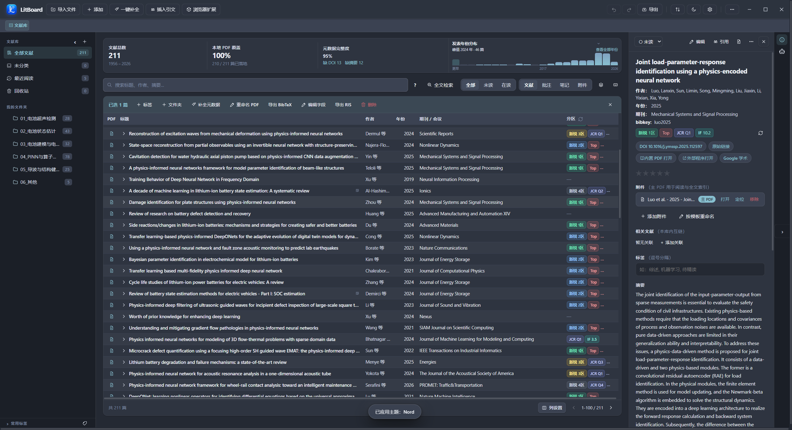</a> 深色 4</td>
  </tr>
  <tr>
    <td width="50%" align="center"><a href="assets/theme/light5.png">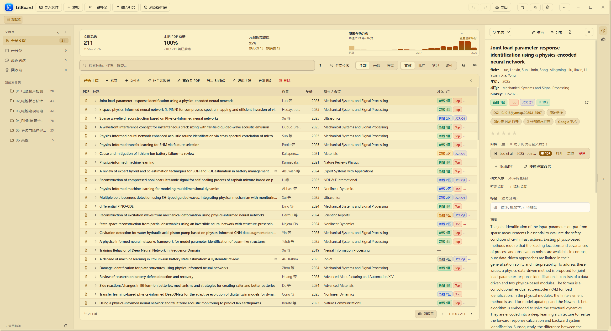</a> 浅色 5</td>
    <td width="50%" align="center"><a href="assets/theme/dark5.png">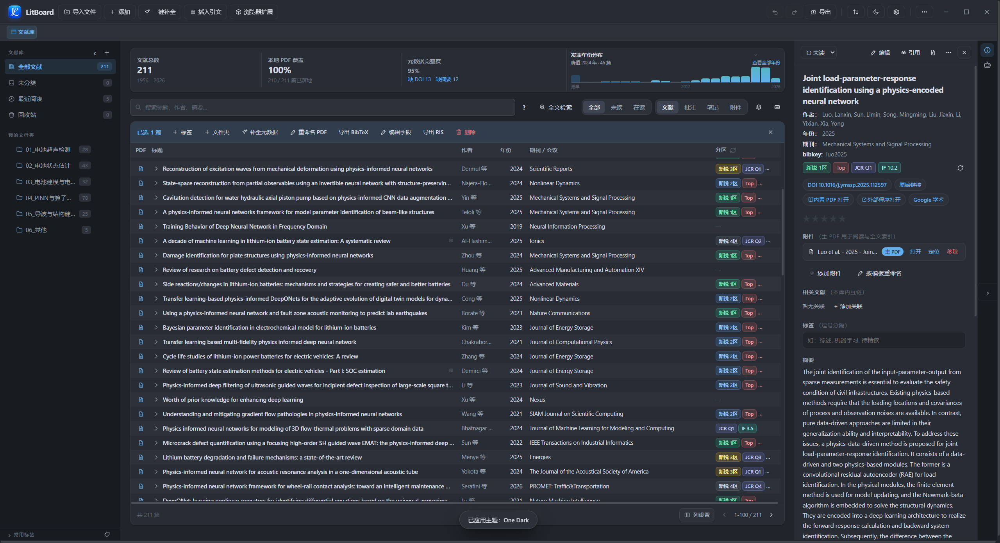</a> 深色 5</td>
  </tr>
</table>

更多功能和安装步骤见[项目说明](../README.zh-CN.md)及[发布与下载说明](release.md)。
